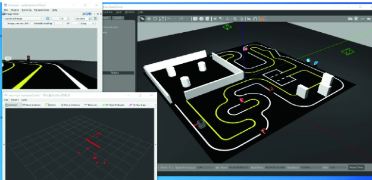

<h2>Auto Race Challange</h2>
<h3>About our project</h3>

<h3>How to download and run</h3>
<ul>
    <li><code>cd ~/ws</code></li>
    <li><code>colcon build --packages-select robot_move robot_description robot_bringup </code></li>
    <li><code>source install/setup.bash</code></li>
    <li><code>ros2 launch robot_bringup autorace_2023.launch.py</code></li>
    <li><code>ros2 run referee_console mission_autorace_2023_referee</code></li>
    <li><code>ros2 launch autorace_camera extrinsic_camera_calibration.launch.py</code></li>
    <li><code>ros2 launch robot_move robot_move.launch.py</code></li>
</ul>

<h2>Cloning: https://github.com/NikitaGoltsev/Auto_Race_challange.git</h2>
<h2>Requirements pip install -r requirements.txt</h2>
